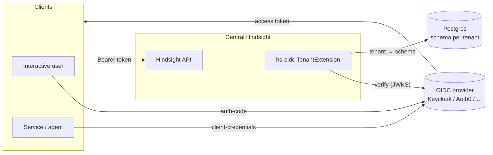
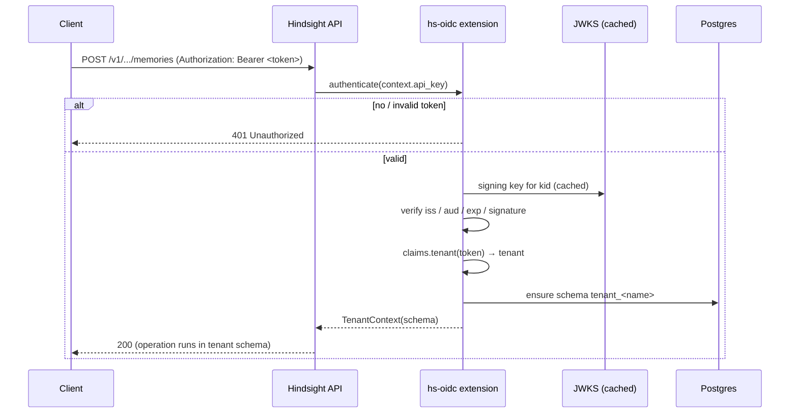
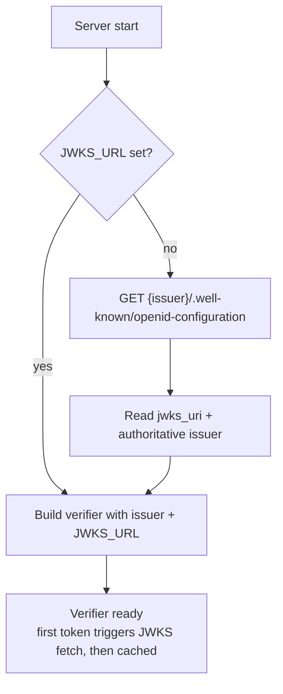
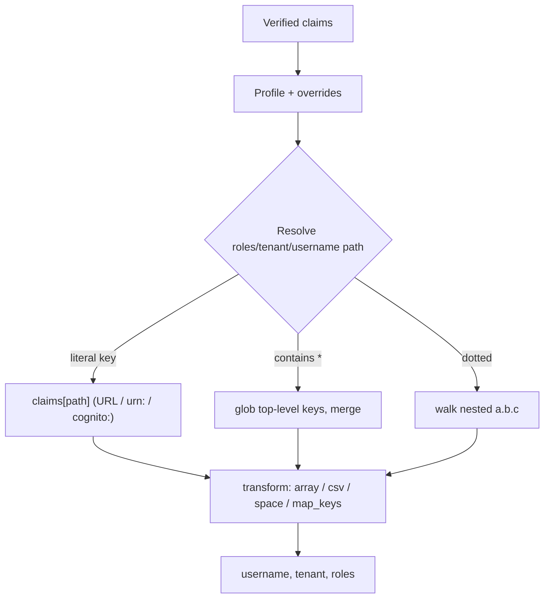
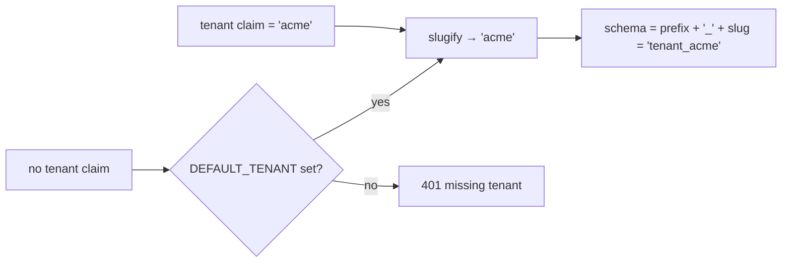

# Summary

Mermaid diagrams (rendered natively by GitHub) for how `hs-oidc-ext` works. For
the UI SSO sequence, see [proxy-trick.md](../proxy-trick.md).

# Topology

# Backend authentication (per request)

# Startup discovery

# Claim resolution

# Tenant → schema

