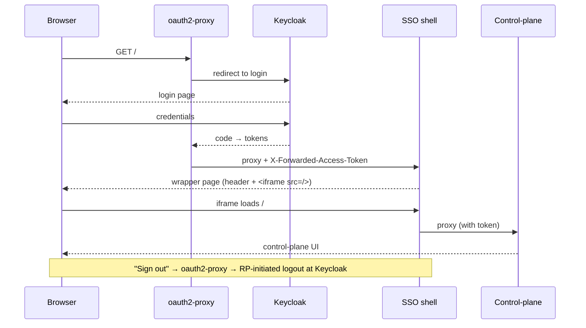

# Overview

The extension protects the **API**. The stock Hindsight **control-plane web UI**,
however, has no login of its own. This optional layer puts SSO in front of it
**without forking Hindsight** — a bundle you run beside the server. It is a
quality-of-life add-on, not required for backend protection.

Runnable version: [`examples/proxy/`](../examples/proxy/).

```
browser ──▶ oauth2-proxy ──▶ sso-shell ──▶ stock control-plane
             OIDC login       identity      (unmodified)
             (Keycloak)       header +
                              iframe
```

# Two pieces

## 1. oauth2-proxy — the login gate

[`oauth2-proxy`](https://github.com/oauth2-proxy/oauth2-proxy) sits in front and
does the OIDC dance against the same issuer the server uses:

- `--provider=oidc --oidc-issuer-url=<issuer>`
- `--pass-access-token` — forwards the user's access token upstream as
  `X-Forwarded-Access-Token`
- `--backend-logout-url=<issuer>/protocol/openid-connect/logout?id_token_hint={id_token}`
  — RP-initiated logout, so "sign out" actually ends the IdP session

## 2. The SSO shell — identity header without forking

A tiny reverse proxy renders a thin **identity header** above the real UI. It must
not inject into the UI's DOM: React 19's streaming SSR strips any foreign node it
finds (hydration error #418). Instead, for a top-level navigation it serves a
wrapper page *it owns* — a **non-sticky** header (username / tenant) above an
`<iframe>` of the real control-plane. Everything else is proxied straight through.
See ADR-009 in [design-decisions.md](design-decisions.md).

# Sequence



# Scope note

This layer shows **who is signed in**; it does not do per-user authorization. In
line with ADR-008, per-user/per-bank filtering belongs to the separate RBAC
extension, not here. The shell grants the signed-in user the same full access the
API already allows.

# Configuration

See [`examples/proxy/README.md`](../examples/proxy/README.md) for the compose file,
the `oauth2-proxy` flags, and the shell proxy. The only client-registration detail:
add `http://localhost:4180/oauth2/callback` to the OIDC client's redirect URIs and
enable RP-initiated logout (`post.logout.redirect.uris`).
